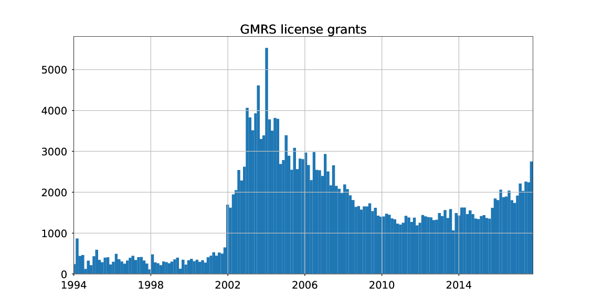

# FCC ULS Transactions analysis

parse FCC ULS transactions data (daily or all) text HS.dat



## Install

```sh
pip install -e .
```

## Usage

This automatically

1. downloads the most recent FCC service license application data for your server.
2. extracts `HS.dat`
3. plots histogram of FCC service license grants vs. time

* GMRS: `python gmrs.py`
* Amateur Radio: `python amateur.py`

## HS.dat codes

* FCC Transaction filename [key](http://wireless.fcc.gov/uls/documentation/pa_intro24.pdf)
* FCC Transaction application [codes](http://wireless.fcc.gov/uls/releases/d992205c.pdf)

New license order of transactions:

* RECNE:    New App Received
* RDLCOM:   Review completed
* FVPCNF:   Payment Confirmed
* RDLCOM:   Review completed
* AUTHPR:   Auth Printed
* APGRT:   Application Granted
* AUTHGE:   Authorization generated (not used after 1998 ?)

## Download data

* [Entire history of FCC](http://wireless.fcc.gov/uls/index.htm?job=transaction&page=weekly) (back to late 1990s)
* GMRS license application [data](http://wireless.fcc.gov/uls/data/complete/a_gmrs.zip)
