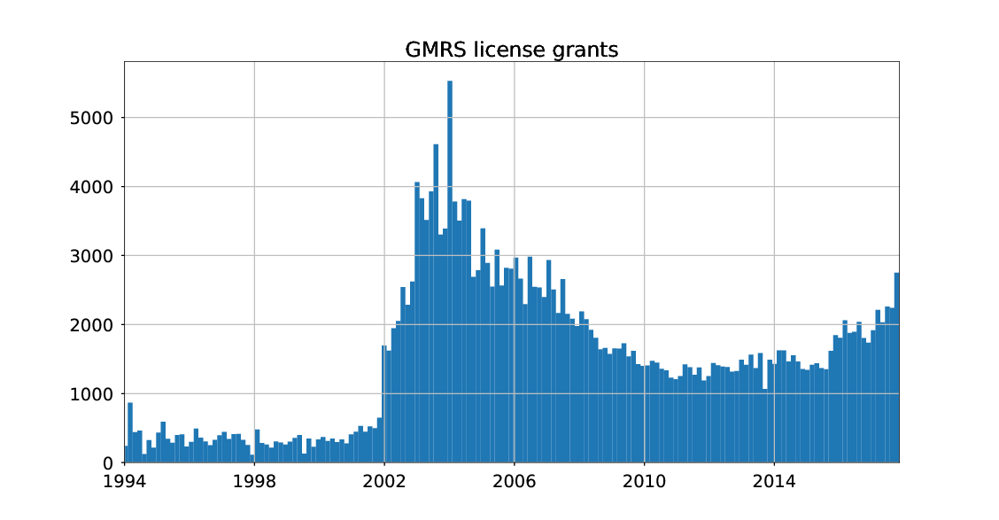

.. image:: https://api.codeclimate.com/v1/badges/90b6f7affdeffbc69167/maintainability
   :target: https://codeclimate.com/github/scivision/fcc-uls-transactions/maintainability
   :alt: Maintainability

=====================
 fcc-uls-transactions
=====================
parse FCC ULS transactions data (daily or all) text HS.dat

Install
=======
:: 
    
    pip install -e .

Usage
=====
This automatically 

1. downloads the most recent FCC service license application data for your server.
2. extracts ``HS.dat``
3. plots histogram of FCC service license grants vs. time

GMRS::

    python gmrs.py

Amateur Radio::

    python amateur.py

HS.dat codes
============

* FCC Transaction filename `key <http://wireless.fcc.gov/uls/documentation/pa_intro24.pdf>`_
* FCC Transaction application `codes <http://wireless.fcc.gov/uls/releases/d992205c.pdf>`_

New license order of transactions:

========  ============
code      Description
========  ============
RECNE     New App Received
RDLCOM    Review completed
FVPCNF    Payment Confirmed
RDLCOM    Review completed
APGRT     App Granted
AUTHPR    Auth Printed
========  ============

:APGRT: Application Granted
:AUTHGE: Authorization generated (not used after 1998 ?)

Download data
=============

* `Entire history of FCC (back to late 1990s) <http://wireless.fcc.gov/uls/index.htm?job=transaction&page=weekly>`_
* GMRS license application `data <http://wireless.fcc.gov/uls/data/complete/a_gmrs.zip>`_
